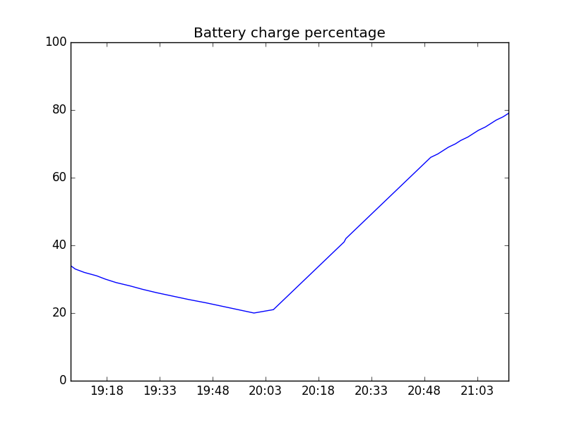

# batterygraph

Outputs a simple python plot with the recent battery charge history.

!

## Prerequisites

* OS: Linux
* `acpi` (battery monitoring utility, available in repositories)
* `python3`
* Python libraries `argparse` and `matplotlib` (installable with `pip`)

## Usage

Before being able to plot your battery usage, you need to execute the script `battery_log` as a daemon. Putting it into autostart would be a good idea.

The script then periodically reads the battery charge and logs it. Executing `batterygraph` then yields a plot of your recent battery usage, depending on the given parameters.

`batterygraph --help` shows all available options.

### Examples

Plot the battery usage of the current day so far:

```
batterygraph -r day
```

Plot the battery usage from 24 hours ago up to now:

```
batterygraph -r day --gliding
```

The keywords for ranges are `hour`, `day` and `month`.

By standard, a graphical, interactive window provided by `matplotlib` is being shown. In order to save the plot to a file instead, provide a filename like this:
```
batteryplot -r day -o output.png
```
